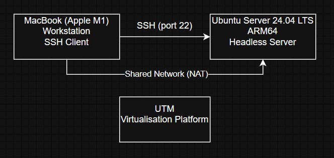
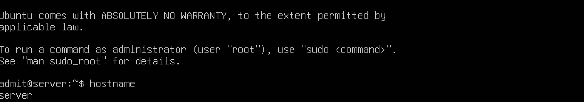
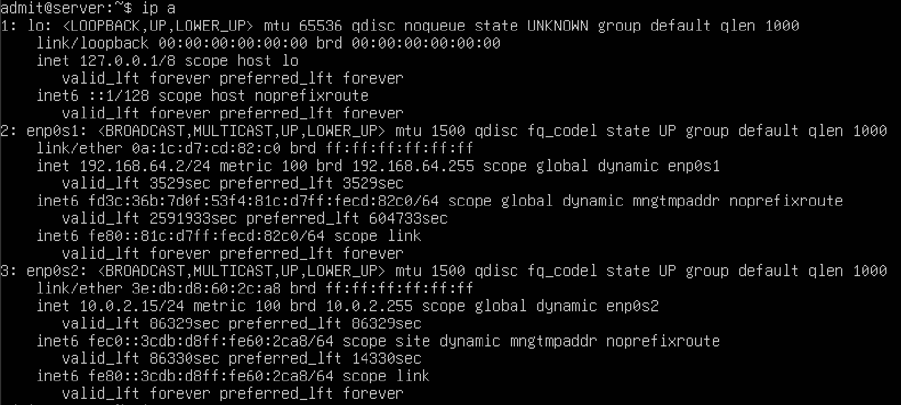
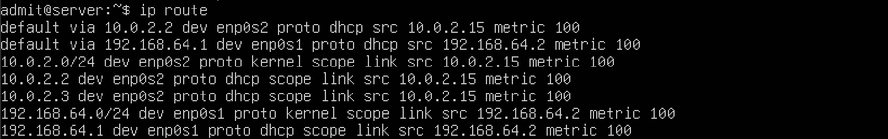

# Week 1 – System Planning and Distribution Selection
[Next Week →](week2.md)
## Overveiw
With week 1 the aim was to plan and deploy a headlss Linux server and verify basic system and network functions using tools. Due to my hardware restaints (Apple M1) I was forced to pivot to UTM instead of VirtualBox, which was used to host the VM while still meeting all coursework requirements.
## System Architecture Diagram

The diagram below shows the system architecture used in Week 1. 
The Ubuntu Server runs as a headless virtual machine inside UTM, while 
administration is performed remotely from the host MacBook using SSH 
over a shared network (NAT).

## System Setup
- **Host machine:** Apple MacBook (M1)
- **Virtualisation platform:** UTM
- **Guest OS:** Ubuntu Server 24.04 LTS (ARM64)
- **Server type:** Headless (no GUI)
- **RAM:** 4 GB
- **CPU:** 2 cores
- **Disk:** 20 GB
## Network Configuration
Two network interfaces were configured:
- **Shared Network (NAT):** Gave internet access for updates and package installation.
- **Emulated VLAN:** Acts as a host-only network for secure local administration and SSH access.

This setup was used to mirror the NAT and host-only adapter architecture used in VirtualBox.
## Command-Line Evidence
### Hostname Verification

Command used:
    hostname

This confirms that the server hostname is correctly configured.

### Network Interfaces

Command used:
    ip a

This shows the active network interfaces and assigned IP addresses.

### Routing Table

Command used:
    ip route

This confirms the default gateway and routing configuration.

### Internet Connectivity Test

Command used:
    ping -c 3 google.com

Successful replies confirm external network connectivity.

## Review
Week 1 was able to successfully achieve the goal of deploying a headles Ubuntu Server VM and verifying basic system and network functionality. The main challenge I faced was adapting and moving to UTM from VirtualBox due to the Apple M1 hardware, which made me use UTM instead of VirtualBox, but this did not prevent me from meeting coursework requirements. Through this process, I gained a clearer understanding of Linux networking concepts, this includes interfaces, routing tables, and NAT-based connectivity. Verifying connectivity using command-line tools reinforced the importance of basic diagnostic commands in server administration. In the next week, I will build on this foundation by focusing on remote access and further system configuration.
