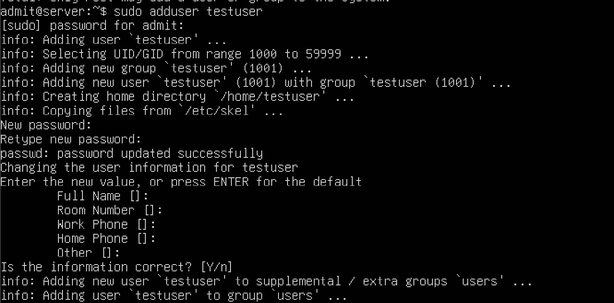
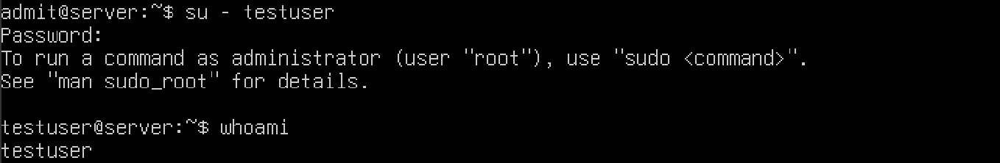
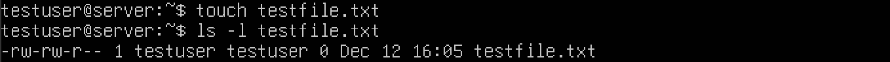

# Week 2 – User and Group Management

[← Previous Week](week1.md) | [Next Week →](week3.md)

## Overview
The aim of Week 2 was to explore Linux user management and file permissions.
This involved creating new users, assigning privileges, and verifying access
control using standard Linux administration commands.

## Tasks Completed
- Created a new user account
- Assigned administrative (sudo) privileges
- Tested user switching and permission boundaries
- Verified file ownership and permissions
## Command-Line Evidence

### User Creation
A new user account named `testuser` was created using the adduser command. This automatically created a home directory and assigned a primary group to the user.

**Command used:**  
`sudo adduser testuser`

---

### Assigning Sudo Privileges
The user was added to the sudo group to allow administrative privileges. Group membership was then checked to confirm the change.

**Commands used:**  
`sudo usermod -aG sudo testuser`  
`groups testuser`

---

### Switching User
The active session was switched to the newly created user. The whoami command was used to confirm the current logged-in user.

**Commands used:**  
`su - testuser`  
`whoami`

---

### File Ownership and Permissions
While logged in as testuser, a file was created in the home directory. File permissions and ownership were verified to ensure correct access rights.

**Commands used:**  
`touch testfile.txt`  
`ls -l testfile.txt`

## Review
In Week 2 I demonstrated core Linux user and group management concepts. Creating a new user, giving administrative privileges, and switching between users showed a clear understanding of account separation and privilege escalation.

Verifying group membership and file ownership confirmed that permissions were correctly applied and enforced by the operating system. This is essential for maintaining system security and controlling access in multi-user environments.

Overall, the tasks completed in this week provided a strong foundation for understanding Linux security, permissions, and user administration, which will be built upon in later weeks.
