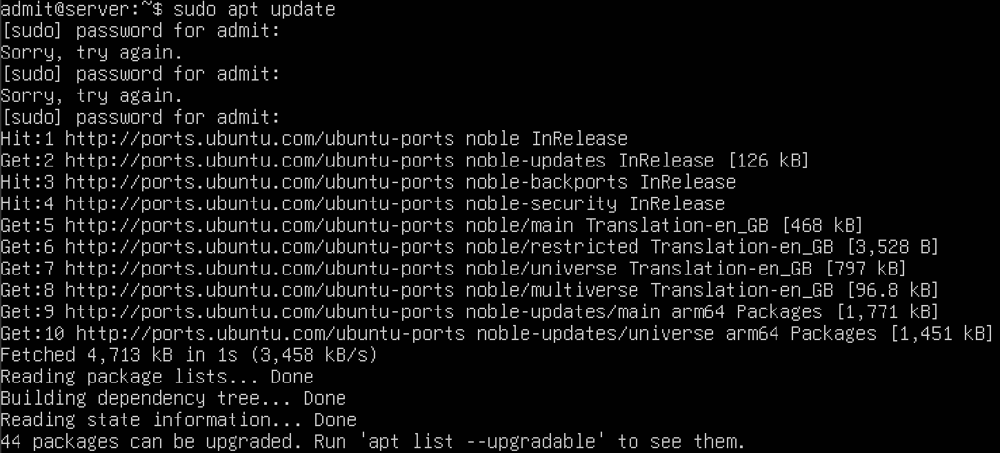
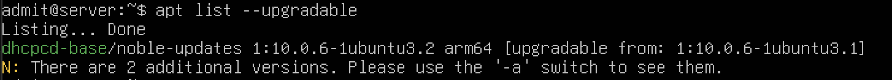
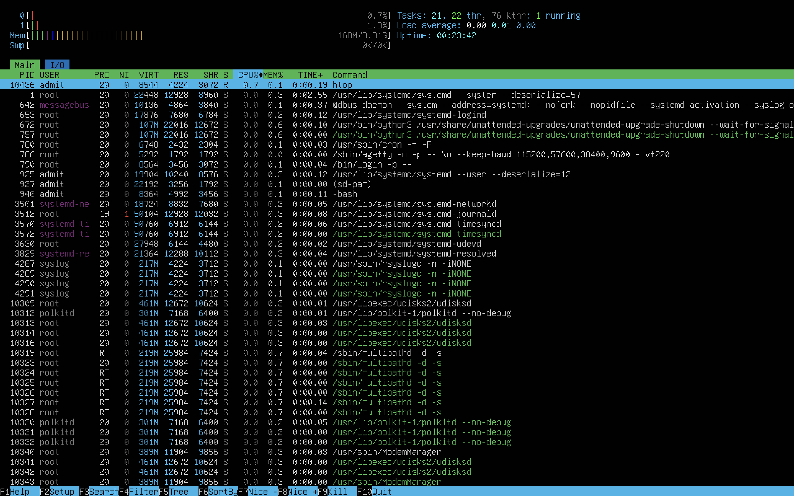

# Week 3 – Package Management and Software Installation

[← Previous Week](week2.md) | [Next Week →](week4.md)

## Overview
Week 3 focused on managing software packages on the Linux server. This included updating the system, upgrading installed packages, installing new software, and verifying that services and applications run correctly.

## System Updates
The package list was updated to ensure the system was aware of the latest available software versions.

**Command used:**  
`sudo apt update`

---

## System Upgrade
Installed packages were upgraded to their latest versions to improve security and stability.

**Command used:**   
`apt list --upgradble`

---

## Software Installation
The htop package was installed to provide an interactive process monitoring tool.

**Command used:**  
`sudo apt install htop`

---

## Software Verification
The installed software was executed to confirm successful installation.

**Command used:**  
`htop`

---

## Review
Week 3 developed practical skills in Linux package management using the APT package manager. Updating and upgrading the system reinforced good maintenance practices, while installing and verifying new software demonstrated effective software management within a Linux server.
