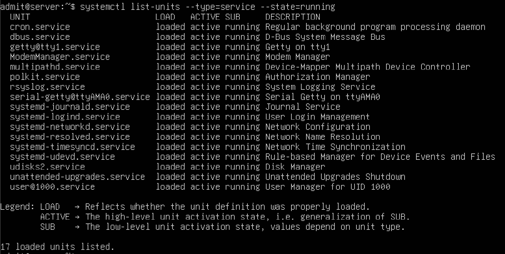
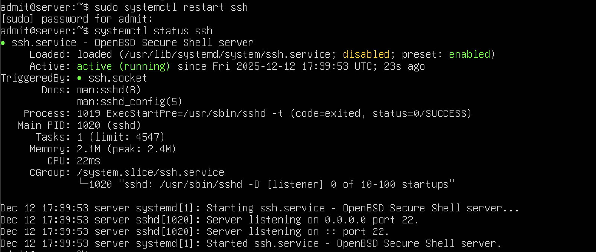
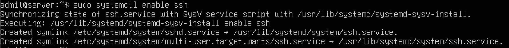
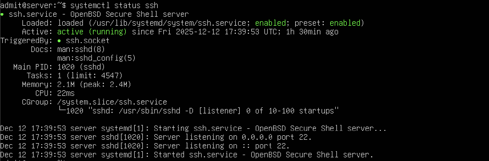

# Week 4 – Initial System Configuration & Security Implementation

[← Previous Week](week3.md) | [Next Week →](week5.md)

## Overview

Week 4 focused on managing system services using `systemd`. The aim was to identify running services, manage the SSH service, and ensure essential services start automatically on boot.

This week reinforced how Linux servers manage background processes and how administrators control system behaviour using service units.

## Tasks Completed

- Listed active system services
- Checked SSH service status
- Restarted the SSH service
- Enabled SSH to start automatically at boot
- Verified service state changes

## Command-Line Evidence

### Running Services
The list of running services shows that essential system services managed by systemd are active, including logging, networking, time synchronisation, and user session management.

**Command used:**
`systemctl list-units --type=service --state=running`

---

### SSH Service Status (Initial State)
The SSH service status was checked using systemd. At this stage, the service was loaded but inactive, demonstrating how service states can be inspected.

**Command used:**
`systemctl status ssh`

---

### Restarting the SSH Service
The SSH service was restarted successfully. This action brought the service into an active running state, confirming that systemd can be used to manage service lifecycles.

**Command used:**
`sudo systemctl restart ssh`

---

### Enabling SSH at Boot
The SSH service was enabled to start automatically at system boot. This ensures persistent remote access after system reboots.

**Command used:**
`sudo systemctl enable ssh`

---

### Verifying SSH Process
The final service status confirms that the SSH daemon is running, managed by systemd, and listening on port 22.

**Command used:**
`systemctl status ssh`

## Review
This week focused on managing system services using `systemctl`. Running services were inspected, and the SSH service was restarted, enabled at boot, and verified as active. This demonstrated an understanding of service management and process control on a headless Linux server.
