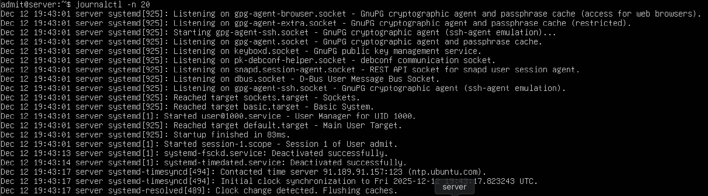
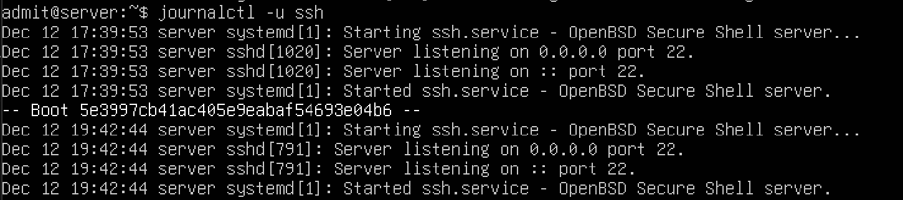
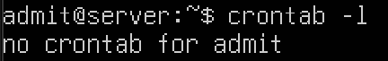
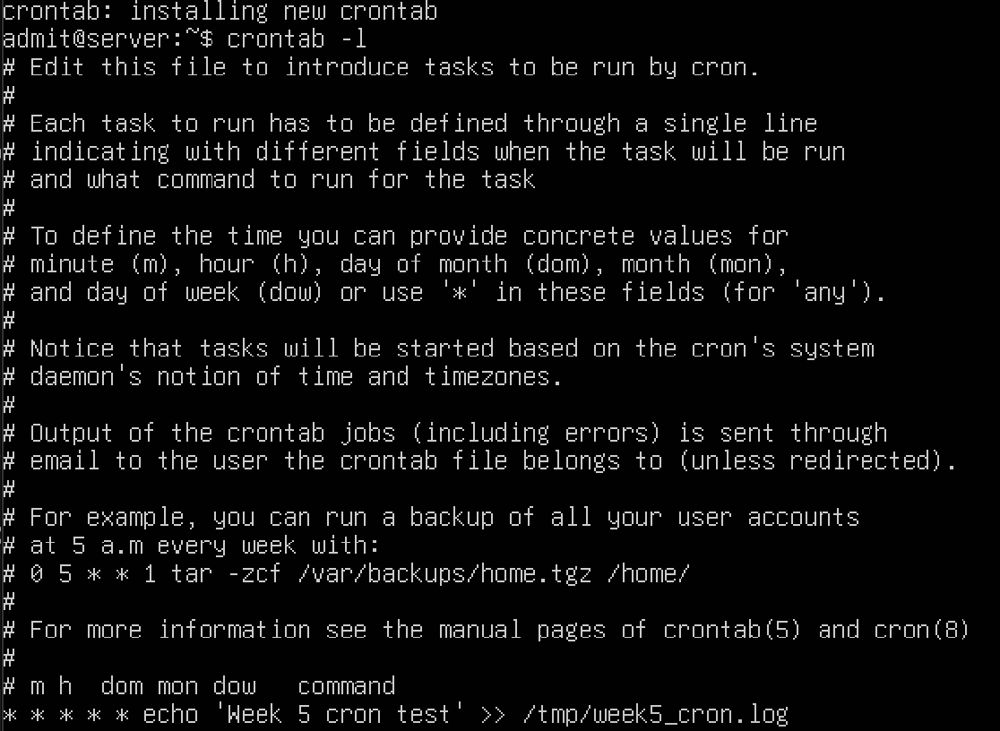
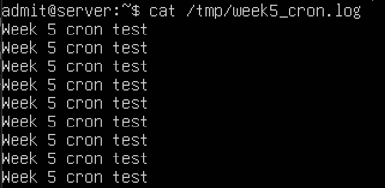

# Week 5 – – System Logs and Scheduling

[← Previous Week](week4.md) | [Next Week →](week6.md)

## Overview
Week 5 focused on monitoring system activity using logs and automating tasks using cron. System logs were inspected to understand service behaviour, and a scheduled task was created to demonstrate job automation.

## Command-Line Evidence

### System Logs
Recent system logs were viewed using journalctl to observe system events and messages.

---

### SSH Logs
Logs related to the SSH service were inspected to verify authentication and service activity.

---

### Cron Job Status (Initial)
The current user crontab was checked to verify whether scheduled tasks already existed.

---

### Cron Job Creation
A scheduled cron job was created to write a test message to a log file every minute.

---

### Cron Job Verification
The output file was checked to confirm that the cron job executed successfully.

## Review
This week improved understanding of system monitoring and task automation. Inspecting logs using journalctl helped interpret system behaviour, while creating a cron job demonstrated how recurring administrative tasks can be automated on a Linux server.
