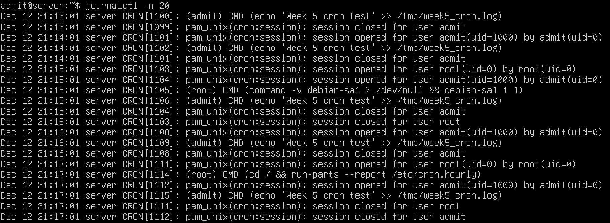
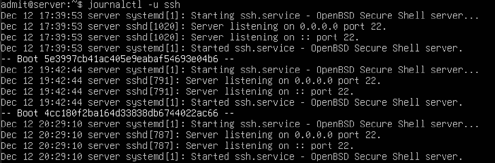
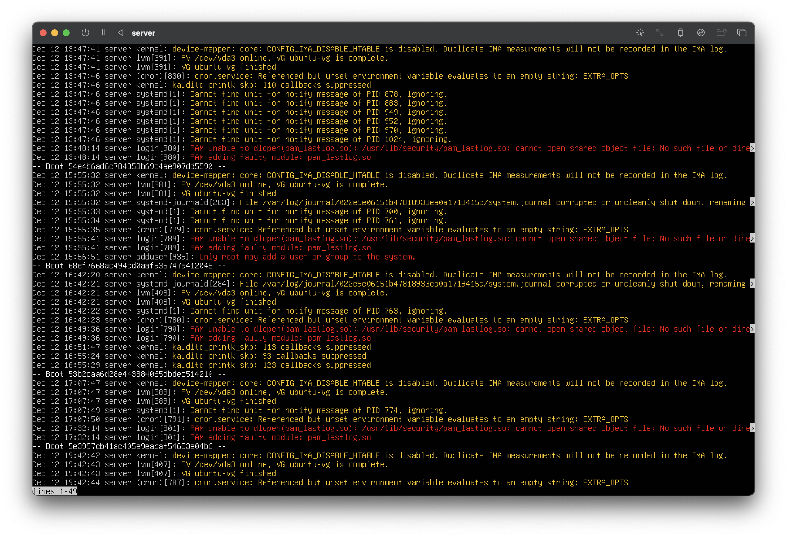

# Week 6 – Performance Evaluation & Analysis

[← Previous Week](week5.md) | [Next Week →](week7.md)

## Overview
Week 6 focused on evaluating system performance and analysing system behaviour using monitoring and logging tools. Resource usage and system activity were reviewed to better understand how the server operates under normal conditions.

## Command-Line Evidence

### System Activity and Logs
System logs were examined to observe general system behaviour and background processes.

**Command used:**
`journalctl -n 20`

---

### SSH Service Activity
Logs related to the SSH service were reviewed to confirm service availability and startup events.

**Command used:**
`journalctl -u ssh`

---

### Warning-Level Messages
System logs were filtered to display warning-level messages, helping to identify non-critical system issues.

**Command used:**
`journalctl -p warning`

## Review
This week strengthened understanding of system performance evaluation and log analysis. Reviewing system logs and SSH activity records provided insight into background processes and system stability, helping develop confidence in monitoring and maintaining a Linux server.
