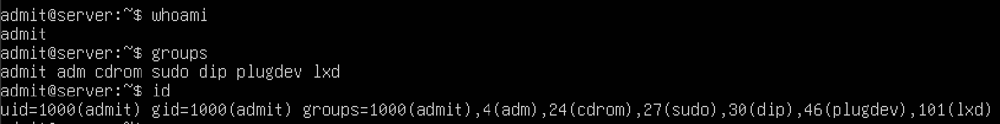
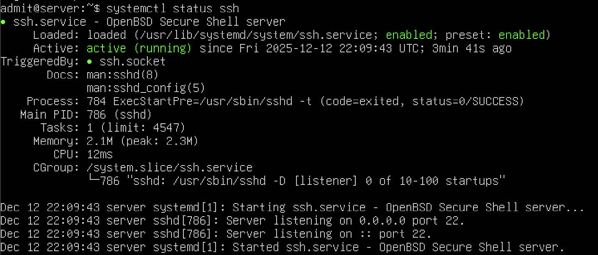
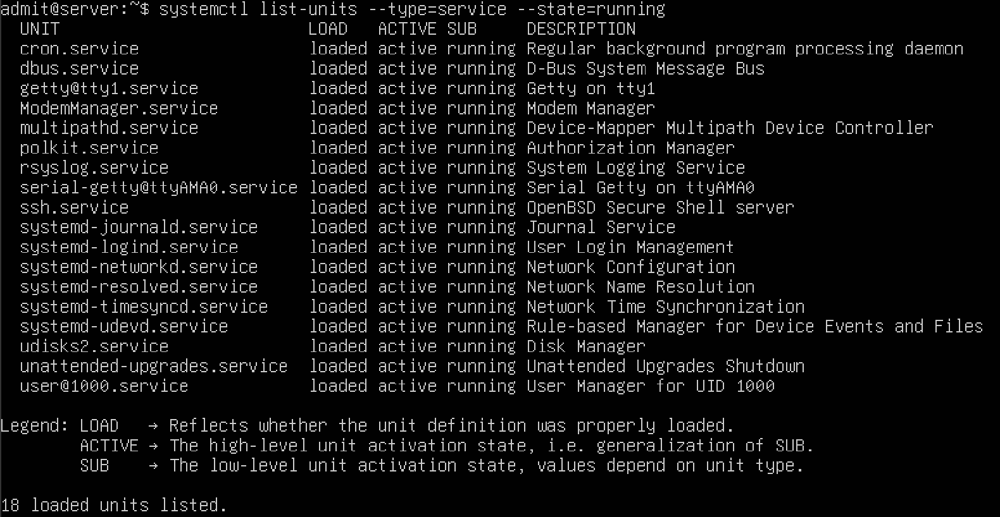
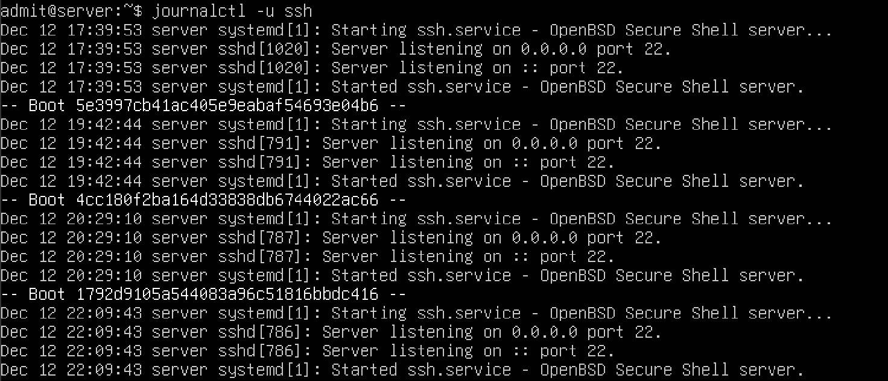

# Week 7 – Security and Hardening

[← Previous Week](week6.md)

## Overview
Week 7 focused on improving system security and applying basic hardening techniques. User privileges, authentication mechanisms, and service exposure were reviewed to reduce potential attack surfaces on the server.

## Command-Line Evidence

### User Privileges and Groups
User accounts and group memberships were reviewed to ensure correct privilege separation and sudo access configuration.

**Command used:**
`whoami`
`groups`
`id`

---

### SSH Configuration Review
The SSH service configuration and status were inspected to confirm secure remote access and service availability.

**Command used:**
`systemctl status ssh`

---

### Active Network Services
Running services were reviewed to identify active network-facing services and ensure only required services were enabled.

**Command used:**
`systemctl list-units --type=service --state=running`

---

### System Logs (Security Events)
System logs were examined to identify authentication events and potential security-related messages.

**Command used:**
`journalctl -u ssh`

## Review
This week improved understanding of Linux system security and basic hardening practices. Reviewing user privileges, SSH configuration, and active services helped ensure the server is securely configured while maintaining necessary functionality. Monitoring security-related logs reinforced the importance of continuous system oversight.
